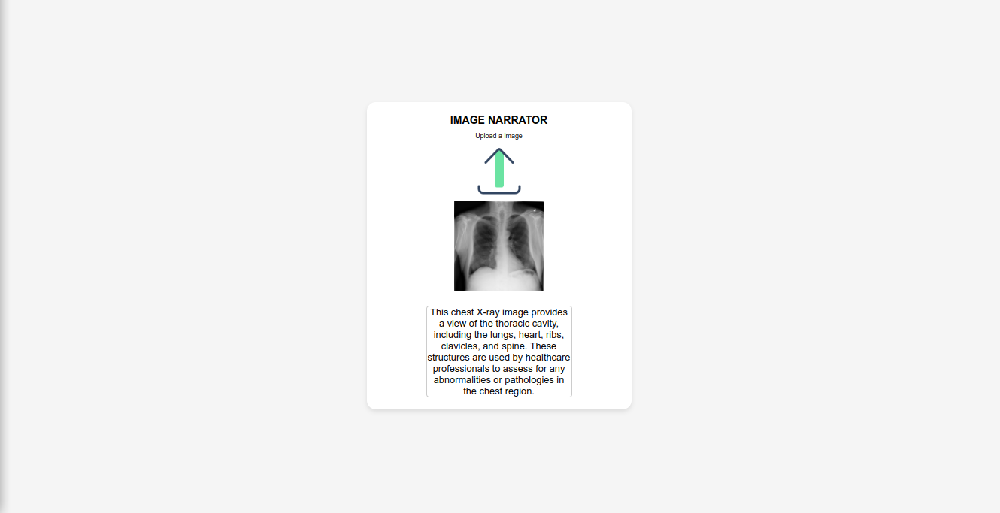

# Image Detection and Explanation with OpenAI GPT-4o API

This repository contains a Flask application that allows users to upload an image. The application uses the OpenAI GPT-4o API to detect and explain what is in the image.

## Features
* Upload an image via a web interface.
* Use the OpenAI GPT-4o API to detect and describe the contents of the uploaded image.
* Display the image and its description on the web page.

## Requirements
* Python 3.10+
* OpenAI API key

## Environment Variables

Rename the `.env.sample` file into `.env` and add your OpenAI API key

## Run Locally

Clone the project

```bash
  git clone https://github.com/smrussel/image-narrator.git
```

Go to the project directory

```bash
  cd image-narrator
```

Install dependencies

```bash
  pip install -r requirements.txt
```

Start the server

```bash
  python app.py
```
Open your web browser and navigate to:

```bash
  http://127.0.0.1:5000
```
## Screenshots




## License

[MIT](./LICENSE)
